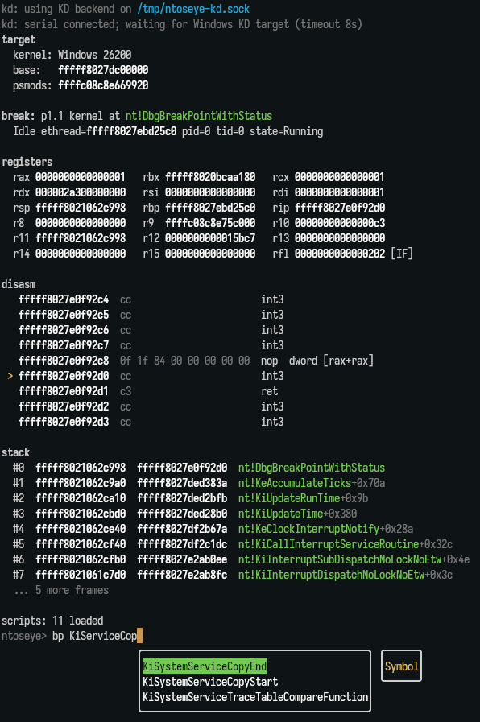

# ntoseye  [](https://crates.io/crates/ntoseye)

Windows kernel debugger for Linux hosts running Windows under KVM/QEMU. Essentially, WinDbg for Linux.

## Features

- Command line interface
- WinDbg style commands
- Kernel debugging
- PDB fetching & parsing for offsets
- Breakpointing (kernel, usermode)
- Two debug backends: QEMU's `gdbstub` (default) and Windows KD over a serial pipe (KDCOM, see [Choosing a backend](#choosing-a-backend))

### Supported Windows

`ntoseye` currently only supports Windows 10 and 11 guests.

### Disclaimer

`ntoseye` needs to download symbols and images to initialize required offsets, it will only download symbols from Microsoft's official symbol server. All files which will be read/written to will be located in `$XDG_CONFIG_HOME/ntoseye`, which includes the following subfolders:
- `commands/` for custom scripted commands
- `images/` for binaries downloaded from the VM
- `symbols/` for PDBs

### Preview



# Getting started

## Install via cargo

```bash
cargo install ntoseye
```

## Building

```bash
git clone https://github.com/dmaivel/ntoseye.git
cd ntoseye
cargo build --release
```

# Usage

It is recommended that you run the following command before running `ntoseye` or a VM:
```bash
echo 0 | sudo tee /proc/sys/kernel/yama/ptrace_scope
```

Note that you may need to run `ntoseye` with `sudo` aswell (last resort, try command above first).

To view command line arguments, run `ntoseye --help`. The debugger is self documented, so pressing tab will display completions and descriptions for commands, symbols, and types.

For examples, refer [here](#usage-examples).

## Choosing a backend

`ntoseye` can talk to the guest two ways. Pick with `--backend gdb` (default) or `--backend kd`.

| | `gdb` (default) | `kd` |
|---|---|---|
| Transport | QEMU's `gdbstub` | Windows KD over a serial pipe (KDCOM) |
| Requires in-guest configuration | No (guest is unaware it's being debugged) | Yes (`bcdedit /debug on`; anti-debug code, PatchGuard, and some Windows behaviour change once enabled) |
| Supports usermode breakpoints | Hardware execution breakpoints only (`hbp`) | Yes |
| Native breakpoints | gdb `Z0`/`Z1` packets | `DbgKdWriteBreakPointApi` |

See [VM configuration](#vm-configuration) for the host-side setup of each backend.

## Agent stdio protocol

Use `--agent-stdio` to run a newline-delimited JSON control protocol instead of the interactive REPL:

```bash
ntoseye --backend gdb --connect 127.0.0.1:1234 --agent-stdio
```

The first line is a `ready` event. Each request is one JSON object with an optional `id`, a `command`, and command fields. Responses are one JSON object per line:

```json
{"id":1,"command":"eval","expr":"nt!MmAccessFault"}
{"id":2,"command":"memory.read","address":"nt!MmAccessFault","length":16}
{"id":3,"command":"disasm","address":"nt!MmAccessFault","length":32}
{"id":4,"command":"dt","type":"KTRAP_FRAME","address":"$rsp","field":"Rip"}
{"id":5,"command":"bp.set","address":"nt!MmAccessFault","kind":"hardware"}
{"id":6,"command":"continue","timeout_ms":1000}
```

Core commands: `status`, `eval`, `registers`, `memory.read`, `memory.write`, `memory.search`, `memory.fill`, `disasm`, `dt`, `trap-frame`, `pte`, `idt`, `gdt`, `tss`, `pool`, `k`, `drivers`, `ps`, `lm`, `load-symbols`, `attach`, `detach`, `threads`, `thread.set`, `bp.set`, `bp.clear`, `bp.disable`, `bp.enable`, `bp.list`, `continue`, `interrupt`, `step`, `qcmd`, `qlog`, `script.list`, `script.reload`, and `quit`. Addresses are expression strings, so symbols, `module!symbol`, arithmetic, casts, and register expressions follow the same parser as the REPL. Binary memory payloads are hex strings.

## VM configuration

It is recommended to disable memory paging and memory compression within the guest operating system to avoid memory-related issues. This only needs to be done once per Windows installation. Run the following commands in PowerShell (Run as Administrator):
```
Get-CimInstance Win32_ComputerSystem | Set-CimInstance -Property @{ AutomaticManagedPagefile = $false }
Get-CimInstance Win32_PageFileSetting | Remove-CimInstance
Disable-MMAgent -MemoryCompression
Restart-Computer
```

### GDBSTUB

Default backend. Expose QEMU's gdbstub on `127.0.0.1:1234` by passing `-s -S`.

#### QEMU

Append `-s -S` to the qemu command.

#### virt-manager

Add the following to the XML configuration:
```xml
<domain xmlns:qemu="http://libvirt.org/schemas/domain/qemu/1.0" type="kvm">
  ...
  <qemu:commandline>
    <qemu:arg value="-s"/>
    <qemu:arg value="-S"/>
  </qemu:commandline>
</domain>
```

### KDCOM

Run with `--backend kd`. In the guest, enable kernel debugging (run as Administrator, then reboot):
```
bcdedit /debug on
bcdedit /dbgsettings serial debugport:1 baudrate:115200
```
Use `debugport:2` instead of `:1` if the KD chardev ends up as COM2 (see the virt-manager subsection below).

#### QEMU

Add a Unix-socket chardev and route a serial port to it:
```
-chardev socket,id=kd,path=/tmp/ntoseye-kd.sock,server=on,wait=off -serial chardev:kd
```
Then connect: `ntoseye --backend kd`.

#### virt-manager

> [!WARNING]
> virt-manager auto-adds a `<serial>` console device on every VM, which
> claims COM1. Either replace that device with one pointing at the KD socket
> (KD becomes COM1, use `debugport:1`), or leave it and add the KD chardev
> via `qemu:commandline` (KD becomes COM2, use `debugport:2`).

**Option A (recommended):** replace the auto-added serial. KD is COM1, `debugport:1` is correct.
```xml
<serial type="unix">
  <source mode="bind" path="/tmp/ntoseye-kd.sock"/>
  <target type="isa-serial" port="0"/>
</serial>
```

**Option B:** keep the auto-added serial and append the KD chardev via `qemu:commandline`. KD is COM2, use `debugport:2`.
```xml
<domain xmlns:qemu="http://libvirt.org/schemas/domain/qemu/1.0" type="kvm">
  ...
  <qemu:commandline>
    <qemu:arg value="-chardev"/>
    <qemu:arg value="socket,id=kd,path=/tmp/ntoseye-kd.sock,server=on,wait=off"/>
    <qemu:arg value="-serial"/>
    <qemu:arg value="chardev:kd"/>
  </qemu:commandline>
</domain>
```

## Scripting

`ntoseye` auto-loads any `*.lua` file in `$XDG_CONFIG_HOME/ntoseye/commands/` at REPL startup. Scripts can register new commands that appear in tab completion and dispatch alongside the builtins. Run `reload` in the REPL to pick up script edits without restarting.

Bundled scripts can be installed/updated with:

```bash
ntoseye scripts install --force
ntoseye scripts list
```

`ntoseye scripts install <source>` also accepts:
- a local `.lua` file
- a local directory of `.lua` files
- single HTTPS URL ending in `.lua`

Local and remote installs print a trust warning and prompt before copying; use `--yes` for non-interactive installs and `--force` to overwrite existing scripts. Remote installs are limited to one `.lua` file and print the downloaded content's SHA-256.

```lua
register_command("name", "help text", function(arg1, arg2) ... end)

-- with per-argument tab-completion hints:
register_command("name", "help text", {"process", "symbol"}, function(a, b) ... end)
```

Completion strategies: `"none"`, `"symbol"`, `"type"`, `"process"`, `"thread"`, `"breakpoint"`, `"driver"`. The strategies table is positional; arg 1 uses the first entry, arg 2 the second, etc. Missing positions fall back to `"none"`. Pass `{}` for an empty table if you want completion turned off explicitly.

Scripts run with a constrained Lua standard library: base globals plus `table`, `string`, `math`, and `utf8`. Host filesystem/process/module access through Lua's `io`, `os`, and `package` libraries is not available; debugger interaction should go through `ntos`.

Host API is exposed under a global `ntos` table:

| function | returns |
|---|---|
| `ntos.ps([filter])` | array of `{pid, name, eprocess}` |
| `ntos.process(target)` / `ntos.try_process(target)` | one `{pid, name, eprocess}`; strict form raises with a candidate list when ambiguous, try_ form collapses both no-match and ambiguous into nil (call `process()` if you need to surface the ambiguity to the user); numeric targets require exact PID |
| `ntos.command_usage()` | nil (prints the current command's registered help) |
| `ntos.eval(expr)` / `ntos.try_eval(expr)` | Address / Address or nil |
| `ntos.read_byte/word/dword/qword(addr)` | integer / integer / integer / Address |
| `ntos.try_read_byte/word/dword/qword(addr)` | value or nil |
| `ntos.read_bytes(addr, len)` / `ntos.try_read_bytes(addr, len)` | Lua string / Lua string or nil |
| `ntos.read_struct(type, addr)` / `ntos.try_read_struct(type, addr)` | table / table or nil (raises if `type` is unknown, that always indicates a script bug, not a runtime condition); only top-level pointer/primitive/bitfield/enum fields decode (nested struct/union/array fields come back as raw byte strings; read those explicitly with `try_read_field_*` using `offset_of`) |
| `ntos.try_read_unicode_string(addr)` | string or nil (`addr` points to a `_UNICODE_STRING`) |
| `ntos.write_byte/word/dword/qword(addr, v)` | nil |
| `ntos.write_bytes(addr, str)` | nil |
| `ntos.loaded_module_list()` | Address (value printed in the startup banner) |
| `ntos.driver_objects()` / `ntos.try_find_driver_object(name)` | array of driver tables / driver table or nil |
| `ntos.kernel_modules()` / `ntos.try_find_kernel_module(name)` | array of `{name, short_name, base, size, end}` / one module or nil (match is exact on `short_name`, substring on `name`, case-insensitive) |
| `ntos.search(addr, len, pattern)` / `ntos.search_first(addr, len, pattern)` | array of Addresses / Address or nil (`pattern` is a raw Lua byte string, e.g. `"\x48\x83..."`) |
| `ntos.offset_of(type, field)` / `ntos.try_offset_of(type, field)` | integer / integer or nil |
| `ntos.type_size(type)` / `ntos.try_type_size(type)` | integer / integer or nil |
| `ntos.fields_of(type)` / `ntos.try_fields_of(type)` | array of field tables / array or nil |
| `ntos.try_read_field_byte/word/dword/qword(type, field, addr)` | value or nil (raises if `type`/`field` is unknown, that always indicates a script bug, not a runtime condition) |
| `ntos.containing_record(entry, type, field)` | Address |
| `ntos.can_read(addr, len)` | boolean |
| `ntos.is_kernel_address(addr)` | boolean (true if `addr` is in the canonical kernel half) |
| `ntos.try_closest_symbol(addr)` / `ntos.try_closest_symbol_any(addr)` | symbol table or nil |
| `ntos.format_symbol(addr)` | `"module!name+0x<offset>"` (no offset suffix when zero); falls back to hex if no symbol resolves |
| `ntos.read_register(name)` | Address (read-only; returned as Address so high-half values render correctly and compose with pointer math, use `:to_int()` for bit-tests on small values) |
| `ntos.addr(n)` | Address (constructor for literals) |

Addresses are an opaque userdata supporting `+ - & | ^ << >> < ==` and `tostring` (renders as hex).

## Credits

Functionality regarding initialization of guest information was written with the help of the following sources:

- [vmread](https://github.com/h33p/vmread)
- [pcileech](https://github.com/ufrisk/pcileech)
- [MemProcFS](https://github.com/ufrisk/MemProcFS)
- [ReactOS](https://github.com/reactos/reactos)
